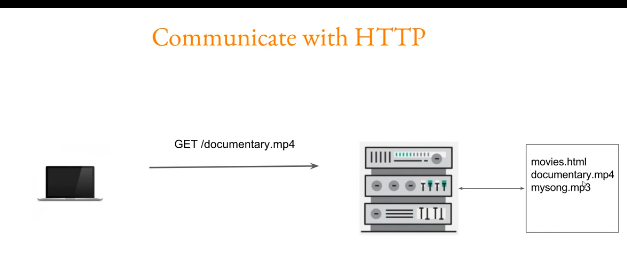

# Nginx 



```
ps -ef --forest | grep nginx
# worker process depending on the number of cpu core if it is set on auto.

master process run as a root
worker process run as non-root, in my case run as www-data


nginx -t
nginx -s reload


# if you want doesn't show nginx version, use this command in /etc/nginx/nginx.conf

server_tokens   off;

# if you want add custom 404.html to your website add this in your virtual server
error_page  404              /404.html;

# but be sure the 404.html must be in the /usr/share/nginx/html


################################################
# the final config file in /etc/nginx/conf.d/site.conf is like this: 

server {
    listen       80;
    listen  [::]:80;
    server_name  localhost;

    #access_log  /var/log/nginx/host.access.log  main;

    location / {
        root   /usr/share/nginx/html;
        index  index.html index.htm;
    }

    error_page  404              /404.html;

    # redirect server error pages to the static page /50x.html
    #
    error_page   500 502 503 504  /50x.html;
    location = /50x.html {
        root   /usr/share/nginx/html;
    }

}
```


```
# attention to content-type
curl -I http://qqq.net/index.html
tcpdump -A -vvvv -s 9999 -i eth0 port 80 > /tmp/headers

```


# This is a sample configuration for reverse proxy 
```
server {
        server_name nginx.example.local;
        location / {
                proxy_pass http://192.168.197.166:80;
                proxy_set_header X-Real-IP $remote_addr;
                proxy_set_header Host $host;

        }

}

server {
        server_name qqq.com;
        location / {
                proxy_pass http://192.168.197.166:80;
                proxy_set_header X-Real-IP $remote_addr;
                proxy_set_header Host $host;

        }

}
server {
        server_name qqq.net;
        location / {
                proxy_pass http://192.168.197.166:80;
                proxy_set_header X-Real-IP $remote_addr;
                proxy_set_header Host $host;

        }

}


```